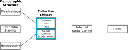

```{r setup, include=FALSE}
knitr::opts_chunk$set(echo = FALSE)
```

<br>

.image-480[

]


---
# Collective Efficacy

*Collective efficacy is a problem-solving capacity that explains why crime is concentrated in certain neighbourhoods: it influences social control* <sup>1</sup> 

<br>


.footnote[[1] Sampson et al. 1997; Sampson 2012]

???

In places high in CE, people intervene for the public good which includes informal social control

---
# The Built Environment

*The built environment explains why crime is concentrated in particular places within neighbourhoods: it influences opportunity* <sup>1</sup> 

<br>


.footnote[[1] Cohen & Felson 1979; Sherman et al. 1989; Wilcox & Cullen 2018]

???

I use routine activities but general idea similar with other opportunity frameworks---some features lead to more criminogenic situations

---
# The Thesis

*Given that...*

* Residents recognize some features of the built environment cause crime <sup>1</sup>

   * e.g., abandoned buildings, bars, vacant lots

.footnote[[1] Innes 2004 [2] Donnelly & Kimball 1997 [3] Sampson 2012 [4] Logan & Molotch 1987]

--

* Residents act collectively to address these problems <sup>2</sup>

--

* Collective efficacy makes collective action more frequent and effective <sup>3</sup>

--

* The built environment changes slowly, for physical and institutional reasons <sup>4</sup>

--

**Neighbourhoods with high collective efficacy in the past will have low crime in the present because they prevented and removed criminogenic features of the built environment.**


---
# Theoretical Model

.image-center[

]

Hypotheses:

* H1: Some present built environment features are criminogenic

* H2: Past collective efficacy reduces present criminogenic built environment features

* H3: Criminogenic features weaken present collective efficacy

* Implied: No effect of past collective efficacy on present crime

---
# Chicago Data


.pull-left[
Key Sources:

* PHDCN Community Survey
* Chicago Community Adult Health Study
   * 8 built environment features
* Chicago Police Department reported crimes
   * Homicide / Gun Violence
   * Robbery
   * All violent crime
   * All property crime

Units:
* 1641 blocks nested in 343 neighbourhood clusters
]
.pull-right[

]

---
# Methods

.image-center[

]


* Hierarchical measurement models for collective efficacy

* Piecewise structural equations to test hypotheses

   * Mix of hierarchical negative binomial and linear regressions
   * D-separation tests of past collective efficacy and present crime


---
# Key Results

* *H1: Some present built environment features are criminogenic*

   * Abandoned buildings predict mainly homicide/gun assault and violence
   * Commerce predicts robbery, violence, and property crimes

--

* *H2: Past collective efficacy reduces present criminogenic built environment features*

   * Past collective efficacy predicts fewer abandoned buildings, commercial destinations, mixed land use, and vacant lots.

--

* *H3: Criminogenic features weaken present collective efficacy*

   * No built environment features predict present collective efficacy

---
# Contributions

Implications for control of the built environment:

* Promotes neighbourhood stability, health, and quality of life
* Implicates collective efficacy in segregation, concentrated disadvantage, and public (dis)investment

--

Integrates collective efficacy with existing theory:

* Criminal opportunity (e.g., Cohen & Felson 1979)
* Political economy of place (e.g. Logan & Molotch 1987)
* Public social control (e.g. Bursik 1989; Velez 2001)

--

Sets up future research:

* Vertical theoretical integration---from political economy to the situation
* Conditions and methods for action to impact built environment
   * Government and institutional responsiveness
   * Points of intervention

---
count: false
class: inverse

# Q&A

# *Thank You!*

---
count: false
class: inverse
# Appendix

---
count: false


---
count: false

.image-540[

]

---
count: false

<br>
<br>

.image-center[

]

---
count: false
# Model Fit Example


---
count: false
# References

.smaller[
* Bursik, Robert J. 1989. “Political Decision-Making and Ecological Models of Delinquency: Conflict and Consensus.” Pp. 105–18 in Theoretical integration in the study of deviance and crime: Problems and prospects, edited by S. F. Messner, M. D. Krohn, and A. E. Liska. Albany, NY: State University of New York Press.
* Carr, Patrick J. 2005. Clean Streets: Controlling Crime, Maintaining Order, and Building Community Activism. New York: New York University Press.
* Cohen, Lawrence E., and Marcus Felson. 1979. “Social Change and Crime Rate Trends: A Routine Activity Approach.” American Sociological Review 44(4):588–608. doi: 10.2307/2094589.
* Donnelly, Patrick G., and Charles E. Kimble. 1997. “Community Organizing, Environmental Change, and Neighborhood Crime.” Crime & Delinquency 43(4):493–511. doi: 10.1177/0011128797043004006.
* Innes, Martin. 2004. “Signal Crimes and Signal Disorders: Notes on Deviance as Communicative Action.” The British Journal of Sociology 55(3):335–55. doi: 10.1111/j.1468-4446.2004.00023.x.
* Logan, John R., and Harvey Luskin Molotch. 1987. Urban Fortunes: The Political Economy of Place. University of California Press.
* Sampson, Robert J. 2012. Great American City: Chicago and the Enduring Neighborhood Effect. Chicago, Ill.: Univ. of Chicago Press.
* Sampson, Robert J., Stephen W. Raudenbush, and Felton Earls. 1997. “Neighborhoods and Violent Crime: A Multilevel Study of Collective Efficacy.” Science 277(5328):918–24. doi: 10.1126/science.277.5328.918.
* Sampson, Robert J., and Stephen W. Raudenbush. 1999. “Systematic Social Observation of Public Spaces: A New Look at Disorder in Urban Neighborhoods.” American Journal of Sociology 105(3):603–51. doi: 10.1086/210356.
* Sherman, Lawrence W., Patrick R. Gartin, and Michael E. Buerger. 1989. “Hot Spots of Predatory Crime: Routine Activities and the Criminology of Place.” Criminology 27(1):27–56. doi: 10.1111/j.1745-9125.1989.tb00862.x.
* St. Jean, Peter K. B. 2007. Pockets of Crime: Broken Windows, Collective Efficacy, and the Criminal Point of View. Chicago: University of Chicago Press.
* Velez, Maria B. 2001. “The Role of Public Social Control in Urban Neighborhoods: A Multilevel Analysis of Victimization Risk.” Criminology 39(4):837–64. doi: 10.1111/j.1745-9125.2001.tb00942.x.
* Wilcox, Pamela, and Francis T. Cullen. 2018. “Situational Opportunity Theories of Crime.” Annual Review of Criminology 1(1):123–48. doi: 10.1146/annurev-criminol-032317-092421.
]